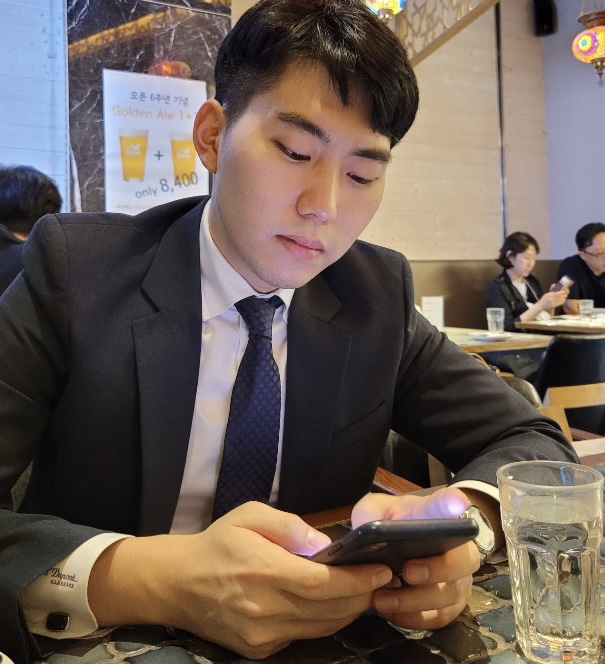

## About Me

Hi! My name is Hoe Sung Ryu.

One of my main interests lies in gathering new knowledge as well as deep understanding in various fields as the goal I seek to achieve is to become a researcher who has the ability to enjoy learning while exploring a subject in his full depths.

If you require any further information, please do not hesitate to contact me.

- Current Position: Ph.D student <a href="http://xai.korea.ac.kr/">in the Department of Artificial Intelligence at Korea University.</a>  
- Advisor: Professor <a href="https://scholar.google.com/citations?hl=en&user=VJuuzLwAAAAJ">Christian Wallraven</a> 
- E-mail: hoesungryu@korea.ac.kr

## Education & Work 
- Researcher in Yonsei University, departments of the mathematics (Apr. - Oct. 2019)
- M.S. in Mathematics, Yonsei University(2017-2019),Advisor: Prof. Youngmi Hur

## Research Interest
- Computer Vision & Emotional touch
- Decision Making & Reinforcement Learning
- Mathematical Modeling & Computing

## Publications
- Unsupervised learning on graphs via Haar scattering, 2019 
- Analysis of Vision Activity using A.I comparison of Machine Learning Models, 2020, Korean journal of Vision Science

## Activity
### Teaching Experiences

|Date|Organization|Name|Hour|
|:-----:|------|----|----|
|Oct. 2020|한국정보화진흥원(NIA) |[해커톤 맨토](https://github.com/hoesungryu/2020_DataCreaterCamp)|48(hr)|
|Sep. 2020|한국정보화진흥원(NIA)| 개인정보 익명조치 A.I 교육 |16(hr)|
|Aug. 2020|과학기술부/한국전파진흥협회|[블록체인 취업연계 교육과정](https://github.com/hoesungryu/blockchain-devML-course)|40(hr)|
|Aug. 2020|[한국직업학교](http://www.koreavc.or.kr/) |자바를 이용한 빅데이터 실무자 양성 교육|88(hr)|
|Jul. 2020|[Cogsys Lab](http://cogsys.korea.ac.kr/Cognitive_Systems.html)|[Hands on Pytorch(for BCE students)](https://github.com/hoesungryu/cogsys_pytorch))|30(hr)

### Teaching Assistant(Yonsei University)

|Date|Subject Code|Subject|
|:-----:|----|----|
|2018|MAT3114-02|Numerical Analysis|
|2018|MAT1012-07|Calculus 2|
|2017|MAT2016-02|Engineering Mathematics|
|2017|MAT1016-06|Calculus 1|

### Teaching Assistant(Company)

|Date|Organization|Name|
|:-----:|----|----|
|Dec 2020 ~ |UpStage X NaverConnected|BootCamp_AI_Tech|
|Jan 8,11 2021|Fast Camp|SK 신입사원교육|

### Projects

|Date|Organization|Name|
|:-----:|------|----|
|2020| Intel Korea | Objected Detection|
|2019| Intel Korea | Image Classification|

## Selected Meeting 

|Date|Organization|Name|
|:--------:|------------|----|
|July 2-4, 2019 |국가수리과학연구소(NIMS)|Medical Mathematical Modeling summer school| 
|April 24-26, 2019|국가수리과학연구소(NIMS)|1st National Institute for Mathematical Sciences moderator program|
|May 25-26 2018|카이스트(KIAST)|KSIAM 2018 spring conference|
|May 17-19 2018|서울대학교(SNU)|2018 Conference on Math to Industry|
|Jun 25-29 2018 |고등과학원(KIAS)| CAC SCHOOL|
|April 5-6 2018 |IEEE| FICC in Singapore |
|Jan 28- Feb2 2018|고등과학원(KIAS)|13th KIAS Geometric Winter School|
|Dec 29-30 2017 |연세대학교(Yonsei)|Machine Learning Coding Winter School|
|Dec 25-29 2017 |국가수리과학연구소(NIMS)| Study Group with Industry|

## Honors & Awards

|Date|Award|Organization|Place|  
|:-------:|--------|----|----|  
|Feb. 2021| 2021 구강계질환 의료영상 AI 경진 대회 |삼성서울병원 / 아주대학교병원 / 한국지능정보사회진흥원 | 3등 |
|Nov. 2019|[제7회 빅콘테스트 챔피언스리그](https://www.bigcontest.or.kr/introduce/history2019.php) | 과학기술부 / 한국정보화진흥원 | 장려상 |
|Sep. 2019|우주전파재난 예측 AI 경진대회 | 국립전파연구원 | 본선 7등 |  
|Sep. 2019|Big data education for university students| 과학기술부/한국데이터산업진흥원 |장려상|

